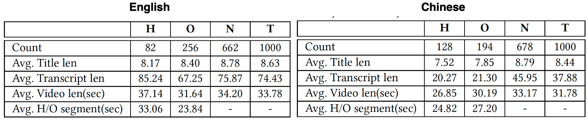
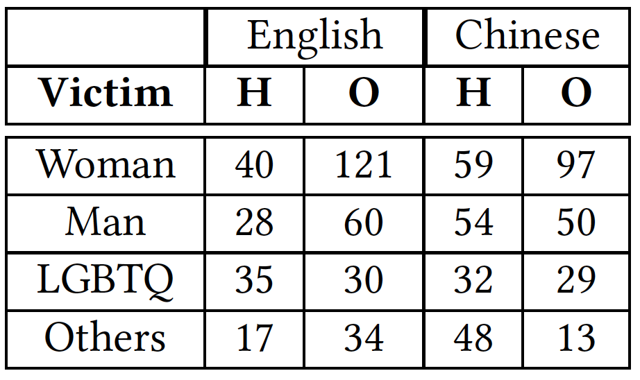
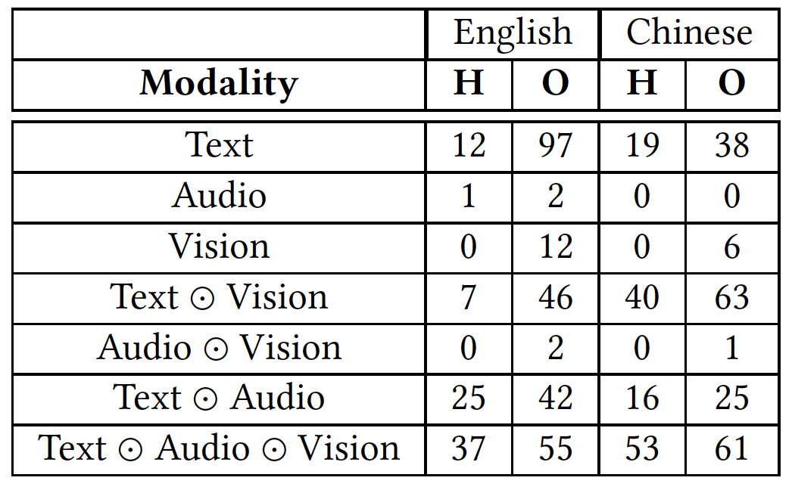
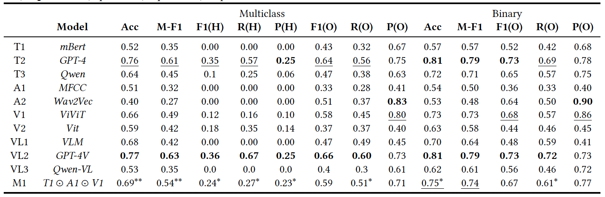
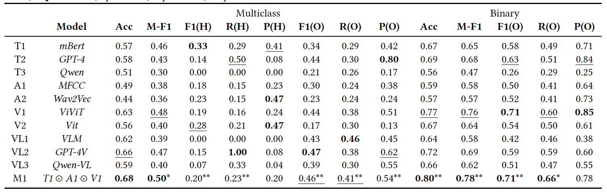

# MultiHateClip

The dataset of our ACM Multimedia'24 paper "MultiHateClip: A Multilingual Benchmark Dataset for Hateful Video Detection on YouTube and Bilibili"

## Human Annotation

We hired 18 undergraduate students, all of whom are Asian individuals aged 18-24, with a balanced gender distribution. Each video was reviewed by at least two annotators, with additional reviewers added if consensus was not reached. 
Videos were initially classified as Hateful, Offensive, or Normal. If deemed Hateful or Offensive, further annotations included identifying the hateful/offensive segment, identifying the target victim, and determining the modality contributing to the hatefulness.

## Dataset Statistics

We curated over 10,000 gender related videos, sourced from YouTube for English content and Bilibili for Chinese content. We reported on 2,000 videos to ensure a balanced label distribution. 
The data statistics are as follows:



The victim distribution of Hateful and Offensive videos as follow



The modality distribution of Hateful and Offensive videos as follow



## Model Evaluation

To evaluate the performance of state-of-the-art models on our dataset, we utilized several pre-trained unimodal and multimodal models. We reported metrics including Accuracy, Macro-F1, F1, Recall, and Precision. Generally, GPT-4V performed best on English content, while the mBert + MFCC + ViViT model excelled on Chinese content. 

The model performance results for English are as follows:



The model performance results for Chinese are as follows:



### Announcements

For public dataset, we only provide the video IDs, which can be used to identify the videos on YouTube and Bilibili. You can use `video_download.py` to download videos by providing the video IDs. However, some high-risk videos may have been removed from the platforms. Unfortunately, we cannot release the raw videos due to copyright restrictions. If you encounter video IDs that are not downloadable, please contact han_wang@sutd.edu.sg, and we will see if we can assist you.

If you find our dataset useful, please cite the paper:

> ```bibtex
> @inproceedings{multihateclip:conf/acmmm/2024,
>   author       = {Han Wang, Tan Rui Yang, Usman Naseem, Roy Ka-Wei Lee},
>   title        = {MultiHateClip: A Multilingual Benchmark Dataset for Hateful Video Detection on YouTube and Bilibili},
>   booktitle    = {ACM MULTIMEDIA 2024},
>   publisher    = {{ACM}},
>   year         = {2024}
> }
> ```